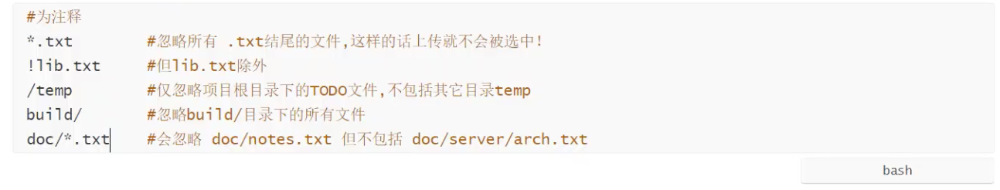

# Linux

## 远程控制

### mac 连接 windows

> Mac端

1. Mac开启服务

```
sudo launchctl load -w /System/Library/LaunchDaemons/ssh.plist
```

2. Mac查看ssh服务是否开启 

```
sudo launchctl list | grep ssh
```

3. Mac查看本地ip地址

```
ifconfig | grep inet   #192.168.2.116
```

4. ssh客户端使用

> ssh只能在Linux和Unix使用，在Windows使用需要利用Xshell软件

```
ssh [-p port] user@remote 
#remote是IP/域名或者别名

ssh -p 22 lenovo@192.168.2.155  #端口号22是默认的，如果不对，换别的
exit  #退出
```


5. scp（secure copy）来远程复制文件

> 端口号记得大写

- `单文件`复制

  ```
  #1.把本地当前目录下的 a 文件 复制到远程家目录下的C:/a
  #注意：`:`后面的路径如果不是绝对路径，则以用户家目录作为参照路径
  #文件后缀记得加上
  scp -P 22 b.rtf lenovo@192.168.2.155:D:/a.rtf  
  
  #把远程家目录下的 C:/a 复制到本地当前目录
  scp -P 22 lenovo@192.168.2.155:D:/a.rtf  b.rtf   
  ```

- Python`文件夹`复制到本地并重命名为demo文件。

  ```
  #把远程家目录下的 /C:/python文件夹里面的内容复制到本地当前目录，重新命名为demo
  #不需要端口啦
  scp -r lenovo@192.168.2.155:D:/python demo
  #反过来一样
  scp -r demo lenovo@192.168.2.155:D:/python
  ```

  

  


> Windows端

开启ssh服务

1. 先在设置里添加openssh服务,步骤如下，[详情见此](https://blog.csdn.net/ujsdui/article/details/84105303)：

   ```
   设置-应用-应用和功能-管理可选功能-添加功能安装OpenSSH服务器和客户端，提示需要重启完成安装，重启电脑，
   ```

2. 然后用[管理员身份运行cmd](https://zhidao.baidu.com/question/394064070489381565.html)

   ```python
   net start sshd #开启ssh服务
   net stop sshd  #关闭ssh服务  注意如果不用命令直接关闭cmd依旧是开启状态哦
   ipconfig       #windowns端查询ip地址 (暂时没法使用grep) lenovo@192.168.22.248
   ```

   

## git管理

[git命令速查](https://github.com/gabrieldejesus/git-commands)

### 问题汇总

1. [如何解决failed to push some refs to git](https://www.jianshu.com/p/835e0a48c825)

### 重要文件位置

`shift + command + . `查看隐藏文件

1. 配置公钥文件 ` /Users/liuchen/.ssh`
2. 用户信息`/Users/liuchen/.gitconfig`
3. 

### 下载地址(镜像)

- [Mac](https://www.newbe.pro/Mirrors/Mirrors-Git-For-MacOS/)
- [Windows](https://npm.taobao.org/mirrors/git-for-windows/)

### 初始化

> 在当前目录新建Git代码库

- 方式一 新建

```
git init
```

- 方式二 克隆

```
git clone [url]
```

> 第一次使用需要设定下自己的用户名和邮箱

```bash
#一般通过此命令直接查询`/Users/liuchen/.gitconfig`是不是直接包含用户名和邮箱
git config --global -l

#如果没有，继续配置
git config --global user.name "yourname"
git config --global user.email "yourmail@XXX.com"

#github
git config --global user.name "Freshflash"
git config --global user.email "1024046931@qq.com"

#码云
git config --global user.name "Freshflash"
git config --global user.email "1091285882@qq.com"
```

<hr>

> 实现免密登录

- 生成自己的公私钥对。

```bash
ssh-keygen -t rsa -C “Your Email Address” -f 'Your Name'
#比如
ssh-keygen -t rsa -C "1024046931@qq.com" -f 'Freshflash'

```

接着会让你输入密码，一路enter，设置密码为空。此时，我们的公私钥对就生成完毕了。

- 将我们的key追加到项目的git中

1. **方法一**

**ssh-copy-id -i ~/.ssh/mservice.pub[git@](https://link.jianshu.com?t=mailto%3Agit%40192.168.XX.XX)XXX.XXX.XXX.XXX**(注：这里的mservice.pub是我自己的起的名字，具体到第2步中，就是命令-f后面的 ‘Your Name’.pub）

之后会让你确认是否连接，输入 yes

2. **方法二**

右上角点到settings——SSH and GPG keys——添加rsa钥匙串——输入github用户密码


> 忽略文件

1. 通过终端 `touch .gitignore`建立`.gitignore`文件。
2. 文件规则
   - 以`#`号开始表示忽略此行
   - `*`代表任意多字符，`?`表示一个字符，[abc]代表任意可选字符。
   - 名称最前`!`表示例外规则，不被忽略。
   - 名称最前路径分隔符`/`，表示忽略此目录下的文件，而子目录文件不忽略
   - 名称最后路径分隔符`/`，表示要忽略此目录下该名称的子目录，而非文件（默认文件或目录都忽略）




### 增

```
git add .
```


###  删

```bash
#删除远程仓库 比如origin
git remote rm origin

#删除远程分支 如自带的main
git push origin --delete main
```


### 改

### 查（看状态）


1. Untracked：未跟踪。此时文件在文件夹中。通过`git add`变为`staged`状态
2. Unmodify：未修改，此时文件已入库。两个去处：若通过修改，会变为`Modified`状态，若通过`git rm`移出版本库，则变为`Untracked`文件
3. Modified：文件已修改，仅仅修改。两个去处：通过`git add`进入`staged`状态，或者`git checkout`丢弃修改，返回`Unmodify`，相当于从库中取出文件。
4. Staged：暂存状态，执行`git commit`会同步到远程库，此时库文件和本地文件一致，文件为unmodify状态，执行`git reset HEAD filename`取消暂存，状态变为Modified。

```
#查看指定文件状态
git status [filename]

#查看所有文件状态
git status

#添加全部文件
git add .

#提交文件
git commit -m "message"
```


